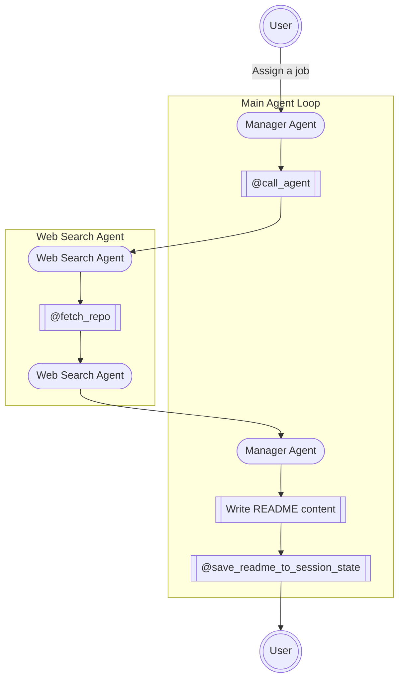

# README Writer Agent

A README.md compiler agent based on a multi-agent system with **GAME** architecture. 

Simply paste in your public github repository url, the agent will automatically generate the `README.md` for you. You could also use this tool to simply explore a repository. 


## Table of Contents

- [README Writer Agent](#readme-writer-agent)
  - [Table of Contents](#table-of-contents)
  - [Architecture](#architecture)
    - [GAME Architecture](#game-architecture)
    - [Multi-Agent Structure](#multi-agent-structure)
  - [Usage](#usage)
    - [Application End point (Streamlit)](#application-end-point-streamlit)
    - [On-premise Usage](#on-premise-usage)
      - [A. Clone the repository](#a-clone-the-repository)
      - [B. Install Dependencies](#b-install-dependencies)
      - [C. (Optional) Configuration](#c-optional-configuration)
      - [D. Startup the Streamlit User Interface](#d-startup-the-streamlit-user-interface)
  - [Contributing](#contributing)

## Architecture
### GAME Architecture
This project utilized the GAME architecture of AI-Agent. The GAME architecture of an AI-Agent system is the abbreviation of:
- Goal
- Action
- Memory
- Environment
This structure ensures the portability and reusability of AI agents. For details of the structure, please view this url: [URL_PLACE_HOLDER].

### Multi-Agent Structure
This project is constructed based on the multi-agent structure. Specifically:

- There is one **manager agent** that serves as the entry point to the agent loop and the interface to interact with users.
- There are **sub-agents** that possesses independent memory with any other agents. In this application, there is only one sub-agent (the `web_search_agent`).
- The manager agent invokes other agents by its exclusive tool: `call_agent`.



## Usage
### Application End point (Streamlit)
> Access our application via the following url:
> 
> 📌 [README Writer Agent on Streamlit](https://readme-compile-agent.streamlit.app/)

### On-premise Usage
#### A. Clone the repository
```bash
git clone https://github.com/Wh4130/remote_readme_agent.git
cd <repo-directory>
```
#### B. Install Dependencies
```bash
pip install -r requirements.txt
```

#### C. (Optional) Configuration
```python
# config.py
MAX_HISTORY = <set the maximum history>
DEBUG = <True to turn on the debug mode>
```
- `MAX_HISTORY`: Do not set this too low, as it may make the agent forgetful.
- `DEBUG`: If set `True`, you could view the thinking process on the streamlit UI.

#### D. Startup the Streamlit User Interface
```bash
streamlit run ./main_st.py
```
This command will start the streamlit UI on your local host.


## Contributing

Guidelines for contributing to the project:

1. Fork the repository
2. Create a feature branch (`git checkout -b feature-xyz`)
3. Commit your changes
4. Open a pull request

